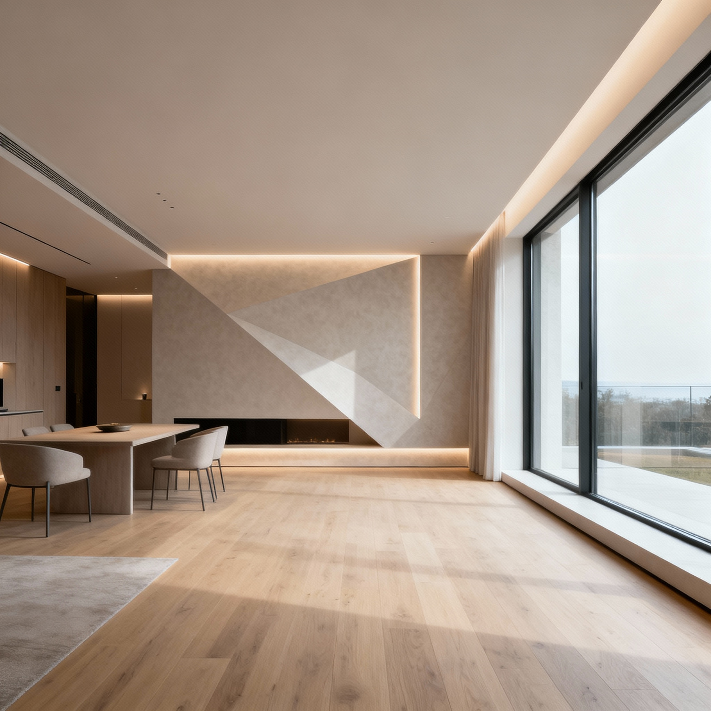
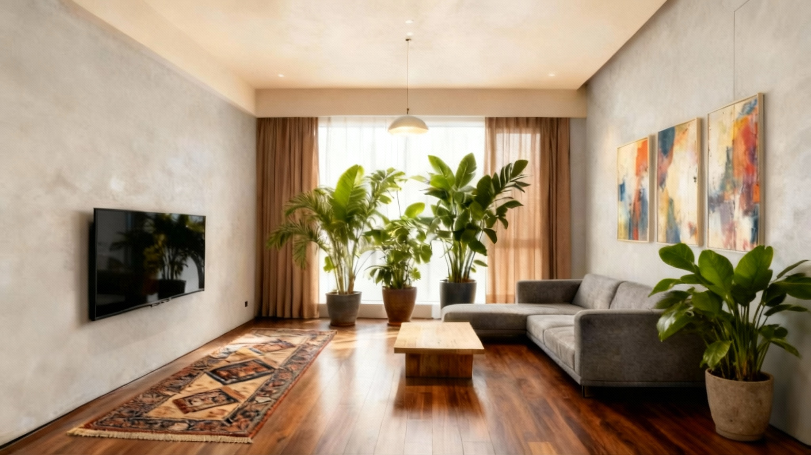
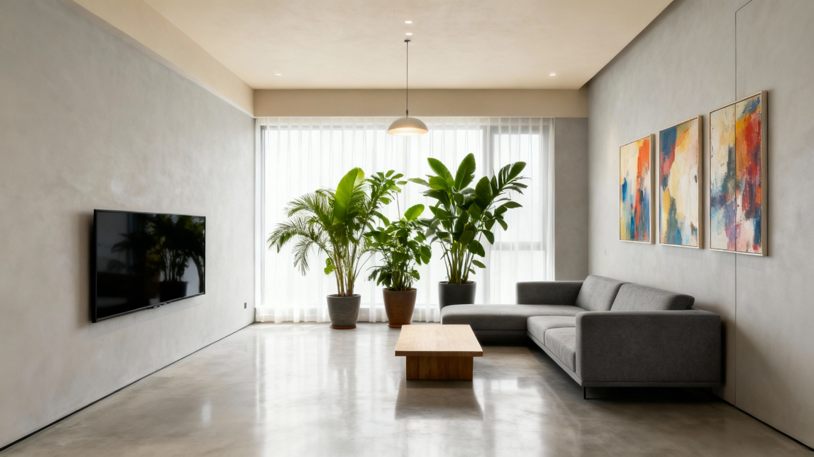
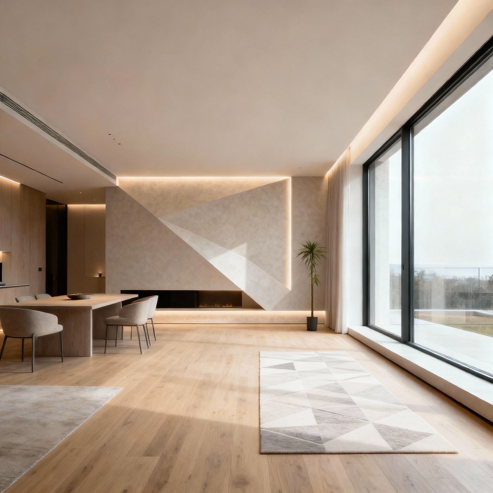
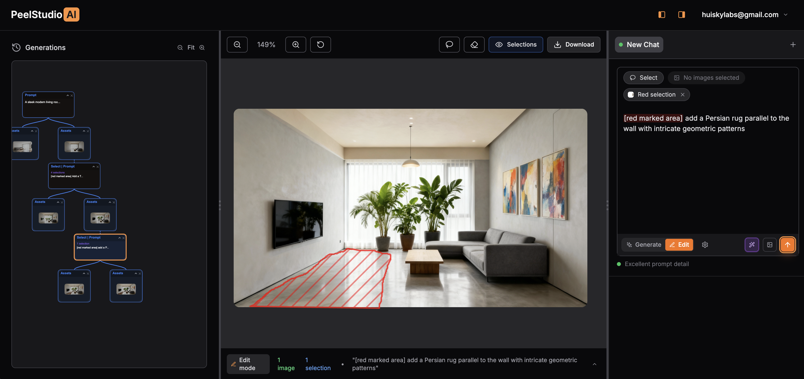

# Why AI Image Generation Feels Like Buying Lottery Tickets (And How to Fix It)

*Finally, a predictable way to create the images in your head*

  

    
    
<em>Before: Original image</em>

  

  

    
    
<em>After: Progressive AI editing</em>

  

## The Problem Every Creator Faces

You know that feeling. You spend 20 minutes writing the perfect prompt for [Midjourney](https://www.midjourney.com), ChatGPT, or Google Gemini. Hit generate. Wait. And get something that's almost right, but not quite what you had in mind.

So you tweak the prompt. Try again. Maybe throw in "ultra-realistic, 8K, trending on ArtStation" because someone on Reddit said it works. Still not there.

This lottery ticket problem is eating up massive amounts of time for creators, businesses, and artists everywhere.

---

**Tired of AI image generation roulette?** [Try PeelStudio's progressive editing approach](https://peelstudio.ai) and get predictable, professional results in minutes instead of hours.

---

## Why Current AI Image Tools Feel Like Gambling

### The Chat-Based Problem

Most AI image generators still work the same way they did for text. You describe what you want, hope the AI gets it, and cross your fingers.

This works fine for simple questions like "What's the capital of France?" But when you're trying to explain a specific visual idea (with the right mood, composition, lighting, and style), words just aren't enough.

The result? An endless loop:

**Craft prompt → Generate → Feel disappointed → Revise → Repeat**

Even when these tools have "editing" features, they still rely on more text prompts. You're still playing the lottery, just with different words.

### The Node-Based Alternative (And Why It's Not the Answer Either)

Tools like [ComfyUI](https://github.com/comfyanonymous/ComfyUI) tried to solve this with node-based workflows. They're genuinely powerful, offering precision and repeatability that text prompts can't touch.

But here's the catch: AI is unpredictable by nature, even with perfectly arranged node graphs. Plus, these systems turn into digital spaghetti really fast. Only the most technical users can navigate them without pulling their hair out.

If you grew up with Photoshop layers and Illustrator artboards, learning node graphs feels like taking a computer science course just to edit a photo.

## What's Actually Missing: Progressive, Predictable Control

The real issue isn't the AI technology. It's the workflow. We need an AI image editor that bridges the gap between the exploratory creativity of traditional design tools, the raw power of AI generation, and the precision of professional editing software.

This is where progressive AI image editing comes in—a better alternative to traditional prompt-based generators like Midjourney and complex node systems like ComfyUI.

## How Progressive AI Image Editing Actually Works

Instead of throwing prompts at a black box and hoping for magic, progressive editing lets you work in stages.

**Start with direction, not perfection.** Generate a handful of base variations from your initial idea. Think of it as digital brainstorming. You're not looking for the final image yet—just interesting starting points.

**Refine through iteration.** Pick the most promising direction, select specific regions, and generate targeted variations. Each step moves you closer to your vision while keeping you in control.

**Maintain complete history.** Every variation, every branch, every decision gets preserved. You can always backtrack, explore different paths, or combine elements from different iterations.

**Use both visual and textual input.** Sometimes a brush selection explains what you want better than any text description. Progressive editing combines the precision of visual tools with the flexibility of text prompts.

## PeelStudio AI: Progressive Editing in Practice

This philosophy is what drives PeelStudio AI, the first AI image editor built specifically for progressive, non-destructive workflows. Think of it as a Midjourney alternative that gives you visual control, or a simplified ComfyUI with an intuitive interface.

Here's how we approach it:

**Progressive, non-destructive workflow:** Node-based precision under the hood with an intuitive, layer-like interface on top. Your complete iteration history gets preserved so you never lose good ideas.

**Visual plus textual editing:** Select regions with familiar brush tools, then enhance those selections with targeted prompts. You get the best of both interaction styles.

**Prompt enhancement:** The AI expands your ideas into richer variations and suggests creative directions you might not have considered. This makes advanced techniques accessible even if you're not a "prompt engineer."

**50+ artistic styles:** Transform photos into any artistic style, maintain consistency across image sets, and get professional results without specialized knowledge.

## Case Study: From Concept to Final Image

Here's how progressive editing changes the creative process:

**Step 1: Generate a foundation.** Begin with a simple concept like "A sleek modern living room, single height with minimum furnishing." and generate 2-3 base variations to explore different directions. I'll pick one with more empty space to edit:

**Step 2: Choose Region for Progressive Editing.** Select region directly with lasso tool to focus on multiple specific areas for progressive refinement. For each selected region, gave a corresponding prompts for editing instructions. Here I drew 4 regions and add prompts to add plants, TV sets, hanging light and paintings:

Once prompts and selections are ready, we can proceed for submit editing, I can choose generate 1-4 images to choose best result from:

The generated results only edit the selected regions while keeping other parts of the image mostly unchanged:

**Step 3: Continue exploring.** Select more regions and iterate by adding more elements progressively:

**Step 4: Final result.** Continue iterating to get your polished final image:

The result is an image that feels intentional and crafted, aligned with your original vision, created in a fraction of the time traditional methods would require.
The entire process is non-distructive as the original layout and basic furnishings are preserved.

Let's compare again the original and our progressive editing results:

  

    
    
<em>Before: Original image</em>

  

  

    
    
<em>After: Progressive AI editing</em>

  

## Moving Past the Lottery Ticket Era

AI image generation doesn't have to feel like gambling. With progressive, non-destructive editing, the process becomes:

- **Predictable:** Each step moves you closer to your goal
- **Creative:** Explore variations without losing progress
- **Accessible:** Professional results without needing prompt engineering expertise
- **Efficient:** Focus your time on creative decisions, not technical workarounds

## Frequently Asked Questions

**What is progressive AI image editing?**

Progressive AI image editing is a workflow that lets you refine images through iterative steps rather than one-shot generation. You start with a base image, select specific regions, apply targeted edits, and build up to your final vision while preserving complete history. It's like editing layers in Photoshop, but powered by AI.

**How is PeelStudio different from Midjourney or DALL-E?**

Unlike text-only AI image generators like Midjourney or DALL-E, PeelStudio combines visual selection tools with text prompts. You can directly select regions with familiar brush tools, then enhance those areas with targeted prompts. This gives you predictable, localized control instead of regenerating entire images and hoping for the best.

**Do I need prompt engineering skills to use PeelStudio?**

No. PeelStudio's built-in prompt enhancement takes your simple ideas and expands them into effective prompts automatically. You can describe what you want in plain language, and the AI handles the technical optimization. This makes professional results accessible without needing to master complex prompt syntax.

**Can I undo changes or explore different creative directions?**

Yes. PeelStudio maintains complete iteration history with non-destructive editing. Every variation and branch is preserved, so you can always backtrack, compare different paths, or combine elements from multiple iterations. Nothing is ever lost.

**What file formats and image types work with PeelStudio?**

PeelStudio works with standard image formats (PNG, JPG, WebP) and supports both AI-generated images and photos. Whether you're editing concept art, marketing materials, interior designs, or personal creative projects, the progressive editing workflow adapts to your needs.

## Ready to Stop Playing the Lottery?

PeelStudio AI is live right now and changing how creators, businesses, and artists approach AI image generation.

Whether you're creating marketing materials, developing concept art, or exploring personal creative projects, progressive editing gives you the control and predictability that current AI tools simply can't match.

[Start creating with PeelStudio AI](https://peelstudio.ai)

No more lottery tickets. No more prompt roulette. Just the images you actually want to create.
